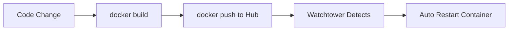

# 🗼 Watchtower Guide — Auto-Update Docker Containers

## Watchtower Kya Hai?

**Watchtower** ek Docker container hai jo aapke running containers ko **automatically update** karta hai jab unki image ka naya version available hota hai.

**Simple Explanation:**
> Aap code change karo → Docker Hub pe naya image push karo → Watchtower detect karega → Purana container band karke naye image se naya container start karega. **Automatically!**

---

## 🔄 Kaise Kaam Karta Hai?

```
Code Change → Docker Build → Docker Hub Push → Watchtower Detects → Container Auto-Update
```



---

## 📋 Setup Steps

### Step 1: Docker Hub Account

1. [Docker Hub](https://hub.docker.com/) pe account banao (agar nahi hai)
2. Terminal mein login karo:
   ```bash
   docker login
   ```

### Step 2: Docker Compose (Already Done ✅)

`docker-compose.yml` mein Watchtower already add hai:
```yaml
services:
  web:
    image: lalitmehta045/alpha-ae-web:latest  # Docker Hub image name
    labels:
      - "com.centurylinklabs.watchtower.enable=true"  # Watchtower ko batao isko monitor karo

  watchtower:
    image: containrrr/watchtower
    volumes:
      - /var/run/docker.sock:/var/run/docker.sock  # Docker access
    environment:
      - WATCHTOWER_CLEANUP=true          # Purane images delete karo
      - WATCHTOWER_POLL_INTERVAL=300     # Har 5 min check karo (seconds mein)
      - WATCHTOWER_LABEL_ENABLE=true     # Sirf labeled containers update karo
```

### Step 3: Start Everything

```bash
docker-compose up -d
```

Yeh dono containers start karega — `web` aur `watchtower`.

---

## 🚀 Update Workflow (Jab Bhi Code Change Karo)

### Local Machine Pe:

```bash
# 1. Code changes karo (jo bhi edit karna hai)

# 2. Image build karo
docker build -t lalitmehta045/alpha-ae-web:latest .

# 3. Docker Hub pe push karo
docker push lalitmehta045/alpha-ae-web:latest
```

### Server Pe:
**Kuch nahi karna!** 🎉 Watchtower automatically:
1. Har 5 min mein Docker Hub check karega
2. Naya image detect karega
3. Purana container stop karega
4. Naya container start karega

---

## ⚙️ Watchtower Settings

| Environment Variable | Default | Description |
|---|---|---|
| `WATCHTOWER_POLL_INTERVAL` | `300` | Kitne seconds mein check kare (300 = 5 min) |
| `WATCHTOWER_CLEANUP` | `true` | Purani images automatically delete karo |
| `WATCHTOWER_LABEL_ENABLE` | `true` | Sirf labeled containers ko update karo |
| `WATCHTOWER_NOTIFICATIONS` | - | Slack/email notifications |

### Poll Interval Change Karna:
```yaml
# Har 1 min mein check karo
- WATCHTOWER_POLL_INTERVAL=60

# Har 10 min mein check karo
- WATCHTOWER_POLL_INTERVAL=600

# Har 1 ghante mein check karo
- WATCHTOWER_POLL_INTERVAL=3600
```

---

## 📝 Complete Workflow Example

```bash
# === LOCAL MACHINE PE ===

# 1. Code edit karo (e.g., koi button change)

# 2. Git commit & push (backup ke liye)
git add -A
git commit -m "feat: updated button text"
git push origin main

# 3. Docker image build karo
docker build -t lalitmehta045/alpha-ae-web:latest .

# 4. Docker Hub pe push karo
docker push lalitmehta045/alpha-ae-web:latest

# === SERVER PE ===
# Kuch nahi karna! Watchtower 5 min mein automatically update kar dega! ✅
```

---

## 🔍 Useful Commands

```bash
# Watchtower logs dekhna
docker logs watchtower

# Force immediate update (bina wait kiye)
docker exec watchtower /watchtower --run-once

# Watchtower restart
docker-compose restart watchtower

# Sab containers ka status
docker-compose ps
```

---

## ⚠️ Important Notes

1. **Docker Hub pe image push karna zaroori hai** — Watchtower sirf registry (Docker Hub) se check karta hai, local changes nahi dekhta
2. **`.env` file Docker Hub pe nahi jaati** — Secrets safe hain
3. **First time** server pe `docker-compose up -d` manually chalana padega — uske baad Watchtower sambhal lega
4. **Private registry** use kar rahe ho toh Watchtower ko credentials dene padenge
